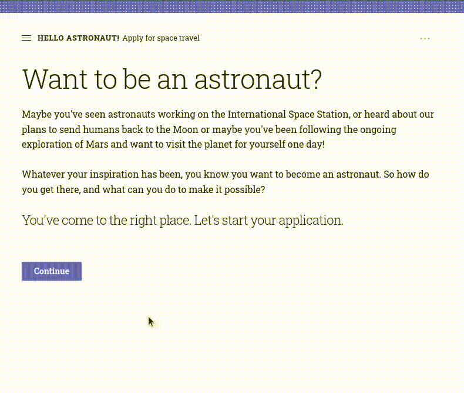

# Nitro

Nitro (N<sub>2</sub>O) is the simplest way to build web apps using Python. No Javascript/HTML/CSS coding.

**Currently a Work in Progress:** 
Follow [the development blog](https://wrong.technology/tags/nitro/) or
[@CrunchingData](https://twitter.com/CrunchingData) for updates, or use
[Discord](https://discord.gg/6RUdk2CPgw) or
[Discussions](https://github.com/h2oai/nitro/discussions) for help / ideas / suggestions.


## Get started

Go to https://nitro.h2o.ai/install/

## Philosophy

Recall how simple it is to author interactive command line applications using Python's built-in `input()` and `print()`:

```py
def main():
    name = input('What is your name?')
    feel = input(f'How do you feel today, {name}?')
    print(f'What a coincidence, {name}, I feel {feel}, too!')
```

```
> What is your name?
> Boaty McBoatface
> How do you feel today, Boaty McBoatface?
> intrigued
> What a coincidence, Boaty McBoatface, I feel intrigued, too!
```

Nitro brings that same level of simplicity to authoring web applications:

```py
from h2o_nitro import View, box

def main(view: View):
    name = view(box('What is your name?', value='Boaty McBoatface'))
    feel = view(box(f'How do you feel today, {name}?', value='intrigued'))
    view(f'What a coincidence, {name}, I feel {feel}, too!')
```


And here's a more elaborate example with seven pages in [seven Python statements](https://github.com/h2oai/nitro/blob/main/py/examples/space_flight.py):



## Vision

**One language, one codebase, multiple screens.**

- Write your app in Python, R, Julia, or Go.
- Access it from six different platforms: web, iOS, Android, Linux, macOS, and Windows.

## Who is it for?

Nitro is for you if:

- You know Python.
- You want to ship a browser-based application, but don't know or care about Javascript.
- You want it to look beautiful, with a simple and friendly user experience.
- You don't care about customizing the visual design too much.
- **You want to write the least amount of code necessary, and ship fast!**

## Status

**H2O Nitro is experimental software. API is subject to change. Do not use in production.**

Critical missing features include data visualization, back-button (history) support, internationalization and localization.

The API is mostly stable, but expect minor changes while we ship support for at least one other 
language (R, Julia, Go  planned), and compile apps to mobile or desktop.

## Features

- **No HTML/Javascript.** Build sophisticated multi-page wizard-like workflows and walkthroughs using pure Python.
- **Library.** Nitro is a library, not a server.
    - Integrates with [Django](https://www.djangoproject.com/) , [Flask](https://flask.palletsprojects.com/), 
      [Starlette](https://www.starlette.io/) , [Tornado](https://www.tornadoweb.org/), [Uvicorn](https://www.uvicorn.org/) 
      and other popular frameworks.
    - Can be integrated into your existing or legacy applications.
    - [Works entirely in-browser via WebAssembly, too](wasm.md)!
- **Less Code.** Laser-focused on keeping application code simple, concise, and clear.
    - **Simplicity.** Page flow follows code flow.
    - **Brevity.** Lowest number of lines of code for expressing solutions to a given problem.
    - **Clarity.** Write apps without jumping through callbacks, request handlers, or event handlers.
- **Minimal API.** Only three functions: `view()`, `box()`, `option()`, and optionally `row()` and `column()` for
  layout.
- **Batteries-included.** Huge library of sophisticated, accessibility-friendly widgets and data visualizations.
- **Prototyping-to-production.** Carefully designed API to rapidly prototype new ideas, then progressively improve
  presentation and aesthetics over time without affecting initial implementation simplicity, or sacrificing control.
- **Unix philosophy.** Tries to do one thing and do it well: display interactive user interfaces. Bring your own web
  app/server of choice and follow its recommendations for hosting, deployment, security, monitoring, metrics and data
  management.
- **Extensively documented.**
    - See https://nitro.h2o.ai/ for documentation.
    - Execute `nitro run https://nitro.h2o.ai/docs.py` to run interactive docs locally with 150+ live examples.

## Differences from H<sub>2</sub>O Wave

**TL;DR:** Use [Wave](https://wave.h2o.ai/) for building visualization-heavy analytical dashboards. For everything else,
use Nitro.

- **Deployment.** Nitro is a library, not a server. It's a heavily stripped-down version of [Wave](https://wave.h2o.ai/)
  with a different, simpler API, designed for integration with existing frameworks, and cross-compiling for mobile and
  desktop apps.
- **Content Management.** Wave is capable of storing and broadcasting content and data, making it simple to build
  dashboards without having to deal with data management. Nitro has no such features.
- **API.** Wave's API is *dashboard-oriented*, and has several features that make it easy to develop and deploy
  real-time analytics and dashboards easily. Nitro's API is *page-flow-oriented*, and makes it radically simple to
  author sophisticated workflows and wizards without dealing with callback functions and request handlers.
